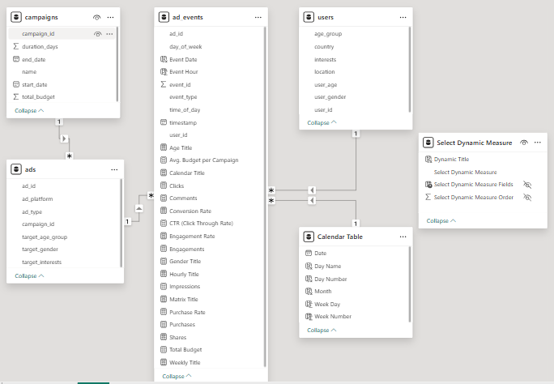
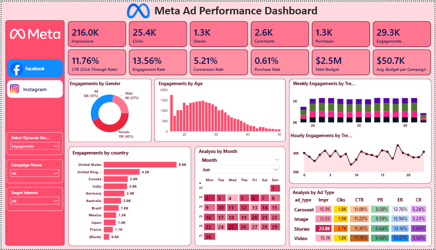

## 📊 Overview
This Meta Ad Performance Dashboard tracks the effectiveness of ad campaigns across key KPIs, such as impressions, clicks, engagements, conversions, and budget. It provides a complete funnel view from awareness to engagement to purchases, along with demographic, geographic, and time-based insights.

---

## 🎯 Business Objective
The business requires a performance tracking report for advertising campaigns running on Facebook and Instagram. This report provides visibility into campaign reach, engagement, conversions, and budget utilization, enabling the marketing team to:
* Identify the most effective platform (Facebook vs Instagram).
* Track campaign ROI and optimize budget allocation.
* Understand audience engagement patterns.

### 📌 Project Scope
* **In Scope:**
    * Campaigns running on Facebook and Instagram only.
* **Out of Scope:**
    * Other platforms (Messenger, Audience Network).
    * Organic engagement (only paid ads will be included).
 
---

## 📁 Dataset

The dataset used for this analysis was provided by my mentor and consists of four interconnected tables. This structured data allows for a comprehensive look at the marketing funnel, from user demographics to ad performance.

*   **Campaigns & Ads (Strategy):** The `campaigns` table defines the high-level budget and timeline, which is then broken down into specific creative formats and targeting rules within the `ads` table.
*   **Users (Demographics):** The `users` table acts as the master demographic record, storing geographic and behavioral attributes (Age, Gender, Interests) of the target audience.
*   **Ad Events (Activity):** This is the central "Fact Table" that records every granular interaction. By linking `user_id` and `ad_id`, we can track exactly how different demographics respond to specific ad types and platforms.

> 💡 *For details breakdown of all tables and column-level descriptions, please refer to the [Full dictionary Documentation](docs/data_dictionary.md).*

---

## 🛠️ Tools & Technologies

* **Power BI**
* **Excel**

---

## 📂 Project Structure

The repository follows a modular structure to separate data, documentation, and reporting assets:
```text
├── datasets/                       # Primary Excel data sources
│   ├── ad_events.xlsx              # 400K+ interaction records
│   ├── ads.xlsx                    # Ad metadata (201 ads)
│   ├── campaigns.xlsx              # Campaign details (51 campaigns)
│   └── user.xlsx                   # Demographic data (9,842 users)
├── docs/                           # Technical documentation
│   ├── data_dictionary.md          # Detailed column descriptions
│   └── kpis_and_definitions.md     # Business logic for calculated metrics
├── images/                         # Visual assets for the project
│   ├── data_model.PNG              # Star Schema architecture diagram
│   ├── facebook_dashboard.PNG      # Power BI Facebook report screenshot
│   └── instagram_dashboard.PNG     # Power BI Instagram report screenshot
├── reports/                        # Interactive BI report files
│   └── visuals.pbix                # Main Power BI dashboard file
├── LICENSE                         # Project licensing information
└── README.md                       # Project overview and methodology

---

## ⚙️ Methodology (Workflow)

This project follows a structured data analytics workflow, ensuring data quality, accurate analysis, and actionable business insights from raw data to final visualization.

### 1. Data Ingestion & Understanding
- Imported 4 primary datasets: `ad_events`, `ads`, `campaigns`, and `users` provided in Excel format.
- Conducted an initial data assessment to understand table relationships, business context, and key performance indicators (KPIs).

### 2. Data Cleaning & Preparation
- Used **Power Query** to assess and improve overall data quality.
- Identified data inconsistencies in the `campaigns` table, where columns such as `start_date` and `end_date` were stored in incorrect text format.
- Applied Python-based preprocessing to standardize and convert date values into valid date format before loading the data into Power BI.
- Performed additional cleaning and transformation steps to ensure consistency and analytical readiness.

### 3. Data Modeling (Star Schema)

The analytical foundation of this project is built using a **Star Schema** within Power BI to ensure scalable data modeling, optimized query performance, and accurate cross-dimensional analysis.

#### 📌 Fact Table
- **`ad_events`** — Central fact table containing measurable campaign performance metrics such as clicks, impressions, conversions, shares, comments, CTR, and Conversion Rate.

#### 📌 Dimension Tables
- **`campaigns`** — Stores campaign-level metadata, objectives, and budget information.
- **`ads`** — Contains ad platform details, creative formats, and ad-related attributes.
- **`users`** — Provides demographic insights including age, gender, and geographic location.
- **`calendar`** — Dedicated date dimension table created to support time-intelligence analysis and date-based reporting.

#### 🔗 Relationship Architecture
The model follows a **One-to-Many (1:*) relationship structure**, where the `ad_events` fact table is connected to each dimension table using unique identifiers such as:

- `campaign_id`
- `ad_id`
- `user_id`
- `date`

This architecture enables seamless drill-down analysis from high-level campaign performance to detailed audience engagement insights.

#### 🏗️ Data Architecture & Relationship Model

<p align="center">
  
</p>

#### 📅 Calendar Table Enhancements
Created a custom calendar table with derived columns to support advanced date-based analysis:

- Day
- Day Name
- Month
- Weekday
- Week Number

#### 📊 DAX & Interactive Analytics
Implemented 12+ business KPIs and dynamic analytical features using DAX, including:

- Dynamic chart titles
- Dynamic measure slicer
- Interactive tooltips for date-wise KPI exploration
- Performance and engagement metric calculations

### 4. Visualization & Insights (Power BI)
Developed an interactive Power BI dashboard focused on:

- **Campaign Performance:** ROI, conversions, and campaign-level KPIs
- **Demographic Analysis:** Performance by age group, gender, and location
- **Platform Comparison:** Comparative analysis of Facebook vs. Instagram ad performance
- **Interactive Reporting:** Real-time filtering and dynamic dashboard exploration

---

## 📊 Key Performance Indicators (KPIs)

The following metrics are used to track and measure the performance of the ad campaigns, categorized by their source and calculation logic:

### 📈 Core Metrics
Directly measured data points from the ad platforms.
* **Impressions:** Total number of times ads were displayed to the audience.
* **Clicks:** Total number of times users interacted with the ads.
* **Purchases:** Total number of successful transactions made after viewing an ad.

### 🧪 Derived Metrics
Calculated metrics that provide deeper insights into campaign efficiency.
* **Engagements:** Total interactions, including clicks, shares, and comments.
* **CTR (Click Through Rate):** The percentage of impressions that resulted in clicks.
* **Engagement Rate:** The percentage of impressions that led to user engagement.
* **Conversion Rate:** The percentage of clicks that resulted in successful purchases.
* **Purchase Rate:** The percentage of total impressions that led to purchases.

### 💰 Budget Metrics
Metrics focused on financial allocation and spending efficiency.
* **Total Budget:** Total spend allocated across all campaigns.
* **Avg. Budget per Campaign:** The average amount of budget distributed per campaign.

> 💡 *For detailed calculation logic, formulas, and usage examples, please refer to the [Full KPI Documentation](./docs/kpis_and_definitions.md).*

---

## 🖥️ Dashboard Overview
The project features a fully dynamic Power BI dashboard with dedicated views for both Facebook and Instagram performance.

### Facebook Ad Performance Dashboard Preview
<p align="center">
  
</p>

The facebook dashboard highlights a highly effective targeting strategy with a strong resonance among the core audience. Key observations include:

* **Conversion & Funnel Excellence:** With a **5.21% Conversion Rate** and **11.76% CTR**, the campaign funnel is well-optimized, successfully turning audience interest into **1.3K total purchases**.
* **Demographic Leadership:** The content resonates most with **Female audiences (44% impressions)**, particularly within the **18-30 age group**, indicating strong engagement from Gen Z and young Millennial segments.
* **Ad Format Excellence:** 
    * **Stories** dominate in visibility and reach, securing **23.8K impressions** and the highest number of clicks for mobile-first users.
    * **Video Ads** provide the highest "stickiness," leading in quality with a **11.78% CTR** and a superior **13.67% Engagement Rate**.
* **Geographic Engagement:** The **United States** remains the primary powerhouse for the campaign, contributing the highest volume of traffic with **64K impressions**.
* **Interaction Quality & Social Proof:** The campaign generated **29.3K total engagements**, including **1.3K shares** and **2.6K comments**, which significantly strengthens the brand's social proof and organic reach.
* **Efficiency Metrics:** Managed with an average budget of **$50.7K**, the campaign demonstrates a high ROI by maintaining strong interaction quality alongside consistent purchase volume.

### Instagram Ad Performance Dashboard Preview
<p align="center">
  
</p>

The Instagram dashboard highlights a highly engaged audience with a strong preference for visual storytelling. Key observations include:

* **High Interaction Quality:** While maintaining a **11.76% CTR**, the **Engagement Rate stands at 13.56%**, indicating that users are not just clicking but actively interacting with the content.
* **Engagement by Demographic:** Female users contribute to **43% of total engagements**, with a significant peak in the **18-25 age group**, showing that the content resonates most with Gen Z and young Millennial women.
* **Ad Format Excellence:** 
    * **Stories** continue to dominate in reach with **23.8K impressions** and **2.7K clicks**.
    * **Video Ads** provide the highest "stickiness," boasting the best **Engagement Rate (13.67%)** and **Conversion Rate (5.56%)**.
* **Geographic Engagement:** Similar to Facebook, the **United States (8.6K engagements)** and **United Kingdom (4.2K engagements)** remain the top performing regions.
* **Efficiency Metrics:** With a **5.21% Conversion Rate** and **0.61% Purchase Rate**, the Instagram funnel is well-optimized for turning casual browsers into buyers.

---

### 💡 Strategic Business Recommendations (Facebook)

Based on the performance data, the following data-driven strategies are recommended to optimize future campaign ROI:

* **Scale Video Content Production:** Since Video ads achieved the highest CTR (11.78%) and Engagement Rate (13.67%), the marketing budget should be prioritized toward high-quality video production over static images to maximize audience interest.
* **Optimize for Female Audience (Ages 18-30):** This segment is the primary driver of impressions (44%). Future ad copies and creative themes should be tailored specifically to resonate with the preferences and trends of young female consumers.
* **Double Down on Story Ads for Reach:** "Stories" generated the highest volume of impressions (23.8K). To increase brand awareness at a lower cost, more "Top-of-Funnel" awareness campaigns should be funneled through the Stories format.
* **Retargeting in High-Potential Markets:** The United States shows massive reach (64K impressions). Implementing a retargeting pixel for US-based users who clicked but didn't purchase (Conversion Gap) could significantly boost the current 5.21% conversion rate.
* **Prime-Time Ad Scheduling:** Hourly trends indicate specific peaks in user activity. Scheduling the majority of the daily budget to be spent during these high-engagement hours can prevent "ad fatigue" and lower the CPC (Cost Per Click).

---

### 💡 Strategic Business Recommendations (Instagram)

To further capitalize on high engagement and improve ROI on Instagram, the following data-driven strategies are recommended:

* **Leverage Video for Conversions:** Video ads achieved the highest Conversion Rate (5.56%) and Purchase Rate (0.66%). Allocating more budget to short-form video content (Reels/Videos) will likely drive more sales compared to static images.
* **Focus on Gen Z & Millennial Women:** Engagement is highest among females (43%) and users aged 18-25. Influencer collaborations and aesthetic, "Instagrammable" creative designs should be prioritized to maintain interest in this demographic.
* **Stories for High-Volume Clicks:** Since "Stories" drive the most clicks (2.7K) and impressions (23.8K), they should be used as the primary channel for limited-time offers, flash sales, and direct "Swipe Up/Link" traffic.
* **Engagement-First Campaigns:** With a higher Engagement Rate (13.56%) than Facebook, Instagram is ideal for brand community building. Implementing "Saveable" and "Shareable" content (like tips or tutorials) can organically reduce the long-term CPA (Cost Per Acquisition).
* **Target Peak Engagement Hours:** The 'Hourly Engagements' trend shows significant fluctuations. Analyzing these peaks and scheduling ad delivery during high-activity hours will optimize the budget and increase the likelihood of immediate user interaction.
* **Geographic Expansion in Top Regions:** Since the US and UK are driving the bulk of the engagement (8.6K and 4.2K respectively), localized content or region-specific offers could improve the Conversion Rate in these high-value markets.

---

## ⚠️ Limitations
* **Static Analysis:** The current insights are based on a 30-day historical snapshot, which may not account for seasonal variations or long-term trends.
* **Attribution Blindness:** Without access to the full customer journey (multi-touch attribution), the analysis primarily focuses on last-click interactions.
* **Platform Constraints:** External factors such as competitor ad spend or changes in social media algorithms are not captured in the dataset.

## 🚀 Future Improvements
* **Harnessing Big Data:** With over **400,000 records** in the `ad_events` table and nearly **10,000 unique users**, I plan to expand this project into a comprehensive multi-page dashboard.
* **Deep-Dive Segment Analytics:** Leverage the **51 campaigns** and **201 individual ads** to conduct granular A/B testing analysis and performance benchmarking.
* **Predictive Modeling:** Utilize the large dataset to build a **Python-based Machine Learning model** for predicting user conversion probability based on interests and demographic data.
* **Advanced DAX & Automation:** Implement more complex Time-Intelligence DAX measures and automate the data refresh cycle using Power BI Service.
