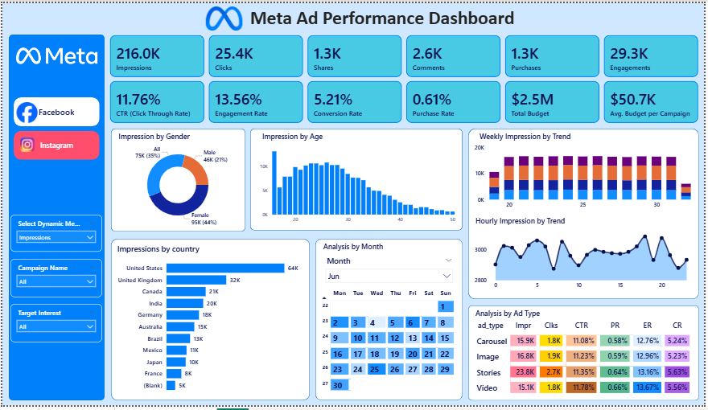

### 📊 Overview
This Meta Ad Performance Dashboard tracks the effectiveness of ad campaigns across key KPIs, such as impressions, clicks, engagements, conversions, and budget. It provides a complete funnel view from awareness to engagement to purchases, along with demographic, geographic, and time-based insights.

---

### 🎯 Business Objective
The business requires a performance tracking report for advertising campaigns running on Facebook and Instagram. This report provides visibility into campaign reach, engagement, conversions, and budget utilization, enabling the marketing team to:
* Identify the most effective platform (Facebook vs Instagram).
* Track campaign ROI and optimize budget allocation.
* Understand audience engagement patterns.

### 🚀 Scope of the Report
* **In Scope:**
    * Campaigns running on Facebook and Instagram only.
* **Out of Scope:**
    * Other platforms (Messenger, Audience Network).
    * Organic engagement (only paid ads will be included).
 
---

### 📊 Key Performance Indicators (KPIs)

The following metrics are used to track and measure the performance of the ad campaigns, categorized by their source and calculation logic:

#### 📈 Core Metrics
Directly measured data points from the ad platforms.
* **Impressions:** Total number of times ads were displayed to the audience.
* **Clicks:** Total number of times users interacted with the ads.
* **Purchases:** Total number of successful transactions made after viewing an ad.

#### 🧪 Derived Metrics
Calculated metrics that provide deeper insights into campaign efficiency.
* **Engagements:** Total interactions, including clicks, shares, and comments.
* **CTR (Click Through Rate):** The percentage of impressions that resulted in clicks.
* **Engagement Rate:** The percentage of impressions that led to user engagement.
* **Conversion Rate:** The percentage of clicks that resulted in successful purchases.
* **Purchase Rate:** The percentage of total impressions that led to purchases.

#### 💰 Budget Metrics
Metrics focused on financial allocation and spending efficiency.
* **Total Budget:** Total spend allocated across all campaigns.
* **Avg. Budget per Campaign:** The average amount of budget distributed per campaign.

> 💡 *For detailed calculation logic, formulas, and usage examples, please refer to the [Full KPI Documentation](./docs/kpis_and_definitions.md).*

---

### 🖥️ Dashboard Overview
The project features a fully dynamic Power BI dashboard with dedicated views for both Facebook and Instagram performance.

#### Facebook Ad Performance Dashboard

  

The campaign demonstrated strong alignment between creative execution and audience targeting, resulting in high engagement rates and efficient conversion metrics across key demographics.

#### 1. Conversion Funnel Performance
The campaign achieved an **11.76% CTR** (Click-Through Rate) and a **5.21% Conversion Rate**. These figures indicate that both the audience targeting strategies and the creative assets were highly effective in driving action.

#### 2. Demographic Leadership
*   **Gender:** Female audiences showed the highest responsiveness, accounting for **44% of total impressions**.
*   **Age Group:** The **18–30 age bracket** emerged as the most active demographic, generating the highest volume of impressions.

#### 3. High-Performing Ad Formats
*   **Stories:** This format secured the highest reach with **23.8K impressions** and the most clicks, highlighting strong mobile-first audience engagement.
*   **Video Ads:** While Stories led in volume, Video ads led in quality, boasting a peak **11.78% CTR** and a **13.67% Engagement Rate**.

#### 4. Geographic Reach
The **United States** served as the primary target market, contributing the highest volume of traffic with **64K impressions**.

#### 5. Engagement Volume
The campaign generated a total of **29.3K engagements**. Key social proof metrics include:
*   **Shares:** 1.3K
*   **Comments:** 2.6K

#### 6. Efficiency & ROI
With an average budget distribution of **$50.7K** per campaign, the strategy successfully secured **1.3K total purchases**, reflecting a structured approach to scaled conversions.
